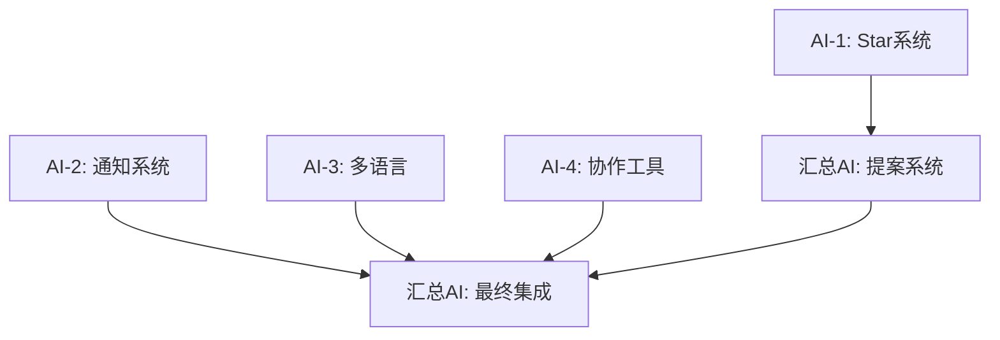

# 最终集成计划 - 汇总AI工作指南

## 🎯 汇总AI职责

作为最终的集成AI，您需要：
1. **等待AI-1完成** Star系统数据库连接
2. **基于AI-1成果** 完成提案系统数据库连接
3. **合并所有分支** 解决代码冲突
4. **统一测试** 确保各模块协同工作
5. **发布完整版本** 交付生产就绪的系统

## 📋 依赖关系图



## 🗳️ 提案系统完善任务

### 等待条件
- ✅ AI-1完成Star系统数据库连接
- ✅ Star API (`/api/stars/*`) 可正常调用
- ✅ StarService接口实现完成

### 核心任务

#### 1. 数据库模型补全
在AI-1完成的基础上，添加提案相关模型到 `prisma/schema-supabase.prisma`：

```sql
model Proposal {
  id          String   @id @default(cuid())
  title       String
  description String
  category    String   // 'feature', 'policy', 'community', 'other'
  authorId    String
  status      String   @default("active") // 'active', 'approved', 'rejected', 'implemented'
  deadline    DateTime?
  createdAt   DateTime @default(now())
  updatedAt   DateTime @updatedAt
  
  author      User     @relation("UserProposals", fields: [authorId], references: [id])
  votes       Vote[]   @relation("ProposalVotes")
  
  @@index([authorId])
  @@index([status])
  @@index([category])
}

model Vote {
  id         String   @id @default(cuid())
  proposalId String
  userId     String
  voteType   String   // 'support', 'against', 'neutral'
  starsUsed  Int      @default(0) // 投入的Star数量
  createdAt  DateTime @default(now())
  
  proposal   Proposal @relation("ProposalVotes", fields: [proposalId], references: [id])
  user       User     @relation("UserVotes", fields: [userId], references: [id])
  
  @@unique([proposalId, userId]) // 每个用户每个提案只能投一次票
  @@index([proposalId])
  @@index([userId])
}

// 更新User模型，添加关系
model User {
  // ... 现有字段
  
  // 新增关系
  starBalance        StarBalance?      @relation("UserStarBalance")
  starTransactions   StarTransaction[] @relation("UserStarTransactions")
  proposals          Proposal[]        @relation("UserProposals")
  votes              Vote[]            @relation("UserVotes")
}
```

#### 2. API端点开发
创建提案管理API：

```
src/app/api/proposals/
├── route.ts              // GET: 获取提案列表, POST: 创建提案
├── [id]/
│   ├── route.ts         // GET: 获取单个提案, PUT: 更新提案
│   ├── vote/route.ts    // POST: 投票
│   └── status/route.ts  // PUT: 更新状态 (管理员)
└── stats/route.ts       // GET: 提案统计
```

#### 3. 服务层实现
创建 `src/lib/proposalService.ts`：

```typescript
export interface ProposalService {
  // 提案管理
  createProposal(data: CreateProposalData): Promise<Proposal>
  getProposal(id: string): Promise<Proposal | null>
  getProposals(filters?: ProposalFilters): Promise<Proposal[]>
  updateProposal(id: string, data: UpdateProposalData): Promise<Proposal>
  deleteProposal(id: string): Promise<void>
  
  // 投票管理
  vote(proposalId: string, userId: string, voteType: VoteType, starsUsed?: number): Promise<Vote>
  getVote(proposalId: string, userId: string): Promise<Vote | null>
  getProposalVotes(proposalId: string): Promise<Vote[]>
  
  // 状态管理
  updateStatus(proposalId: string, status: ProposalStatus): Promise<Proposal>
  checkAutoStatusUpdate(proposalId: string): Promise<void>
  
  // 统计信息
  getProposalStats(proposalId: string): Promise<ProposalStats>
  getUserProposalStats(userId: string): Promise<UserProposalStats>
}
```

#### 4. 前端重构
重构 `src/app/proposals/page.tsx`：
- 移除localStorage操作
- 使用API调用替代本地存储
- 集成AI-1的Star API
- 添加实时投票更新
- 优化用户体验

#### 5. Context更新
重构 `src/contexts/StarContext.tsx` 中的提案相关逻辑：
- 移除本地提案存储
- 使用ProposalService
- 保持接口兼容性

## 🔄 分支合并计划

### 合并顺序
1. **AI-1 (Star系统)** → `main` (优先合并，其他依赖此分支)
2. **AI-2 (通知系统)** → `main` (独立功能)
3. **AI-3 (多语言)** → `main` (独立功能)
4. **AI-4 (协作工具)** → `main` (独立功能)
5. **提案系统** → `main` (基于AI-1完成后)

### 冲突解决策略

#### 数据库Schema冲突
```bash
# 合并策略：以AI-1为基准，其他AI的Schema追加
1. 先合并AI-1的schema-supabase.prisma
2. 逐个合并其他AI的模型定义
3. 检查关系冲突，手动调整
4. 运行 npx prisma db push 验证
```

#### 依赖包冲突
```bash
# 解决package.json冲突
1. 合并所有新增依赖
2. 统一版本号（选择最新兼容版本）
3. 运行 npm install 测试
4. 解决版本冲突
```

#### TypeScript类型冲突
```bash
# 类型定义冲突处理
1. 统一类型定义到 src/types/
2. 避免重复定义
3. 使用命名空间隔离
4. 更新导入路径
```

### 合并检查清单

#### 每个分支合并前检查
- [ ] 分支可以独立构建成功
- [ ] 没有ESLint错误
- [ ] 基本功能测试通过
- [ ] 数据库迁移脚本正常
- [ ] 环境变量文档完整

#### 最终集成检查
- [ ] 所有模块功能正常
- [ ] 模块间接口调用成功
- [ ] 数据库Schema完整
- [ ] 构建和部署成功
- [ ] 性能指标达标

## 🧪 集成测试计划

### 功能集成测试

#### Star系统 + 提案系统
```typescript
describe('Star-Proposal Integration', () => {
  test('创建提案消费Star', async () => {
    // 1. 用户有足够Star
    // 2. 创建提案
    // 3. 验证Star被扣除
    // 4. 验证提案创建成功
  })
  
  test('投票消费Star', async () => {
    // 1. 用户投票
    // 2. 验证Star被扣除
    // 3. 验证投票记录
  })
})
```

#### 通知系统集成
```typescript
describe('Notification Integration', () => {
  test('Star变化触发通知', async () => {
    // 1. Star数量变化
    // 2. 验证通知发送
  })
  
  test('提案状态变化通知', async () => {
    // 1. 提案状态更新
    // 2. 验证相关用户收到通知
  })
})
```

#### 多语言集成
```typescript
describe('I18n Integration', () => {
  test('所有模块支持语言切换', async () => {
    // 1. 切换语言
    // 2. 验证所有模块文本更新
  })
})
```

### 性能测试

#### 并发测试
- 100个用户同时创建提案
- 1000个用户同时投票
- 数据库连接池压力测试

#### 响应时间测试
- API响应时间 < 300ms
- 页面加载时间 < 2s
- 实时通知延迟 < 1s

## 📊 最终验收标准

### 功能完整性
- ✅ Star系统完全迁移到数据库
- ✅ 提案系统支持真实投票
- ✅ 通知系统实时推送正常
- ✅ 多语言100%覆盖
- ✅ 协作工具基本可用

### 数据一致性
- ✅ Star余额跨设备同步
- ✅ 投票结果实时更新
- ✅ 用户数据完整性
- ✅ 并发操作安全性

### 性能指标
- ✅ 页面加载 < 2s
- ✅ API响应 < 300ms
- ✅ 数据库查询优化
- ✅ 内存使用合理

### 代码质量
- ✅ TypeScript类型完整
- ✅ ESLint检查通过
- ✅ 测试覆盖率 > 80%
- ✅ 代码注释清晰

## 🚀 发布准备

### 环境配置
```env
# 生产环境变量
DATABASE_URL="postgresql://..."
NEXTAUTH_SECRET="..."
GITHUB_ID="..."
GITHUB_SECRET="..."

# 新增环境变量
EMAIL_SERVER_HOST="smtp.gmail.com"
EMAIL_SERVER_USER="..."
EMAIL_SERVER_PASSWORD="..."
NOTIFICATION_WEBHOOK_URL="..."
```

### 数据库迁移
```bash
# 生产环境迁移步骤
1. 备份现有数据
2. 运行迁移脚本
3. 验证数据完整性
4. 更新应用配置
5. 重启服务
```

### 部署检查清单
- [ ] 环境变量配置完整
- [ ] 数据库连接正常
- [ ] 第三方服务配置
- [ ] SSL证书有效
- [ ] 监控告警设置
- [ ] 备份策略实施

## 📅 时间安排

### 第一阶段 (Day 1-3): 等待并行开发
- 监控各AI进度
- 准备集成环境
- 设计合并策略

### 第二阶段 (Day 4-5): 提案系统开发
- **Day 4**: 数据库模型 + API开发
- **Day 5**: 前端重构 + 基础测试

### 第三阶段 (Day 6): 最终集成
- **上午**: 合并所有分支
- **下午**: 解决冲突，集成测试
- **晚上**: 部署验证，文档整理

## 🎯 成功标准

项目成功的标志：
1. **所有模块正常工作** - 没有功能缺失
2. **数据完全同步** - 告别localStorage时代
3. **用户体验流畅** - 响应快速，界面友好
4. **代码质量高** - 可维护，可扩展
5. **生产就绪** - 可以立即发布使用

## 🤝 协调机制

### 与其他AI的沟通
- 每日检查各AI进度
- 及时反馈集成需求
- 协调接口变更
- 解决技术问题

### 问题上报渠道
- 技术问题：在对应AI的分支提Issue
- 接口冲突：更新API_CHANGES.md
- 紧急问题：直接沟通解决

预计完成时间: 6个工作日
最终目标: 交付完整的、生产就绪的GistFans v1.0 