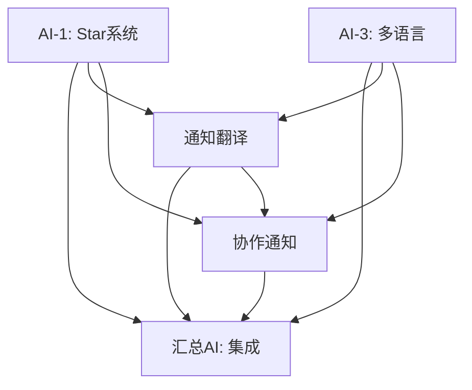

# GistFans AI并行开发项目总览

## 项目结构

```
AI_PARALLEL_TASKS/
├── README.md                           # 项目总览和执行流程
├── PROJECT_OVERVIEW.md                 # 本文件 - 项目结构说明
│
├── AI-1_STAR_SYSTEM/                   # AI-1 Star系统数据库连接
│   ├── TASK_SPECIFICATION.md           # 详细任务规范
│   ├── COLLABORATION_STANDARDS.md      # 协作标准和代码规范
│   └── PROGRESS.md                     # 进度跟踪文档
│
├── AI-2_NOTIFICATION/                  # AI-2 通知系统实现
│   ├── TASK_SPECIFICATION.md           # 详细任务规范
│   ├── COLLABORATION_STANDARDS.md      # 协作标准和代码规范
│   └── PROGRESS.md                     # 进度跟踪文档
│
├── AI-3_I18N/                         # AI-3 多语言系统完善
│   ├── TASK_SPECIFICATION.md           # 详细任务规范
│   ├── COLLABORATION_STANDARDS.md      # 协作标准和代码规范
│   └── PROGRESS.md                     # 进度跟踪文档
│
├── AI-4_COLLABORATION/                 # AI-4 协作工具扩展
│   ├── TASK_SPECIFICATION.md           # 详细任务规范
│   ├── COLLABORATION_STANDARDS.md      # 协作标准和代码规范
│   └── PROGRESS.md                     # 进度跟踪文档
│
└── INTEGRATION_GUIDE/                  # 汇总AI集成指南
    ├── FINAL_INTEGRATION_PLAN.md       # 最终集成计划
    ├── COLLABORATION_STANDARDS.md      # 汇总AI协作标准
    ├── API_CHANGES.md                  # API变更记录
    └── ISSUES.md                       # 问题跟踪文档
```

## AI任务分配

### 🔴 AI-1: Star系统数据库连接 (高优先级)
- **工期**: 3天
- **依赖**: 无
- **核心任务**: 将localStorage的Star系统迁移到Supabase数据库
- **关键交付**: StarBalance、StarTransaction数据模型和API

### 🟡 AI-2: 通知系统实现 (中优先级)
- **工期**: 4天
- **依赖**: 无（独立开发）
- **核心任务**: 实现实时通知推送、邮件通知、通知中心UI
- **关键交付**: 完整的通知系统

### 🟡 AI-3: 多语言系统完善 (中优先级)
- **工期**: 3天
- **依赖**: 无（独立开发）
- **核心任务**: 支持中英日韩4种语言，完善翻译系统
- **关键交付**: 完整的多语言支持

### 🟢 AI-4: 协作工具扩展 (低优先级)
- **工期**: 5天
- **依赖**: 无（独立开发）
- **核心任务**: 屏幕共享、实时代码编辑、文件传输、语音通话
- **关键交付**: 高级协作功能

### 🔴 汇总AI: 提案系统完善 + 最终集成 (高优先级)
- **工期**: 2天
- **依赖**: 等待AI-1完成
- **核心任务**: 提案系统数据库化 + 所有模块集成
- **关键交付**: 完整的GistFans v1.0

## 协作关系图



## 文件说明

### 任务规范文件 (TASK_SPECIFICATION.md)
每个AI的详细任务说明，包含：
- 任务目标和范围
- 技术实现方案
- 数据库模型设计
- API接口规范
- 测试要求
- 交付标准

### 协作标准文件 (COLLABORATION_STANDARDS.md)
每个AI的开发规范，包含：
- 代码风格和命名规范
- 提交信息格式
- 分支管理策略
- 测试覆盖率要求
- 文档更新规范
- 与其他AI的协作方式

### 进度跟踪文件 (PROGRESS.md)
每个AI的实时进度，包含：
- 每日任务完成情况
- 遇到的技术问题
- 依赖关系状态
- 测试覆盖率统计
- 风险评估
- 下一步计划

## 关键协作点

### 1. 数据库模型协调
- **AI-1**: 定义Star相关数据模型
- **AI-2**: 定义通知相关数据模型
- **AI-4**: 定义协作相关数据模型
- **汇总AI**: 定义提案相关数据模型，确保所有模型兼容

### 2. API接口统一
- 所有AI遵循统一的API响应格式
- 错误处理和状态码标准化
- 身份验证和授权机制一致

### 3. 组件和样式协调
- 使用项目现有的UI组件库
- 保持设计系统一致性
- 响应式设计标准

### 4. 测试策略协调
- 单元测试覆盖率目标：80%
- 集成测试覆盖关键流程
- 端到端测试验证用户体验

## 质量保证

### 代码质量
- TypeScript严格模式
- ESLint + Prettier代码格式化
- 代码审查检查清单

### 测试质量
- 单元测试 + 集成测试 + 端到端测试
- 测试覆盖率监控
- 性能测试基准

### 文档质量
- API文档完整性
- 代码注释规范
- 用户使用指南

## 风险管控

### 技术风险
- 数据库模型冲突 → 提前设计，统一规范
- API接口不兼容 → 标准化响应格式
- 组件样式冲突 → 使用统一UI库

### 进度风险
- AI延期完成 → 关键路径监控，及时调整
- 依赖阻塞 → 清晰的依赖关系定义
- 集成冲突 → 分阶段集成，逐步验证

### 质量风险
- 测试覆盖不足 → 明确测试要求和标准
- 性能问题 → 性能基准和监控
- 安全漏洞 → 安全检查清单

## 成功标准

### 功能完成度
- ✅ Star系统完全数据库化
- ✅ 提案系统真正可用
- ✅ 通知系统实时推送
- ✅ 多语言支持完整
- ✅ 协作工具功能丰富

### 质量标准
- ✅ 代码质量达标
- ✅ 测试覆盖率 > 80%
- ✅ 性能指标达标
- ✅ 安全要求满足

### 生产就绪
- ✅ 部署脚本完整
- ✅ 监控系统配置
- ✅ 文档齐全
- ✅ 用户体验优秀

## 项目时间线

```
第1天: AI-1, AI-2, AI-3, AI-4 同时开始
第2天: 继续并行开发
第3天: AI-1完成，AI-3完成，其他继续
第4天: 汇总AI开始提案系统，AI-2完成
第5天: 汇总AI继续，AI-4完成
第6天: 汇总AI完成最终集成
```

## 联系方式

各AI如遇问题，请在对应的`ISSUES.md`文件中记录：
- 问题描述
- 影响范围
- 紧急程度
- 需要的协助

汇总AI将定期检查所有问题并协调解决。 