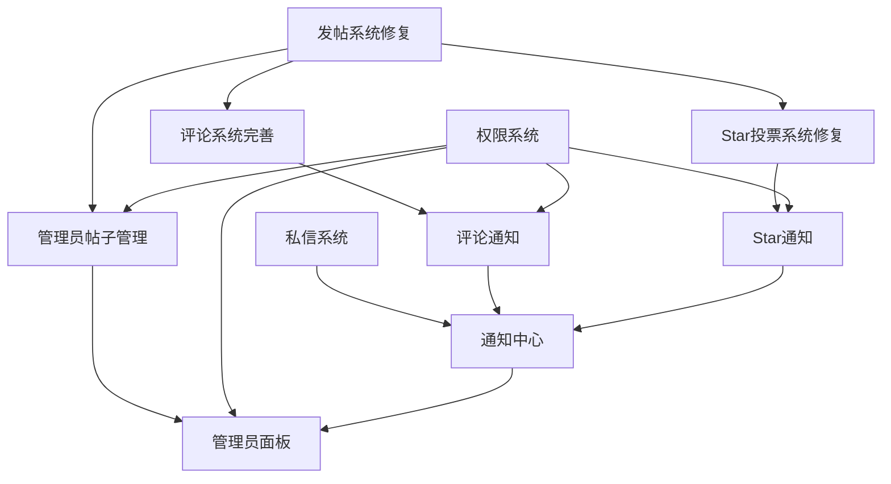

# GistFans 开发路线图

## 🎯 总体目标

**项目**: GistFans开发者社区平台功能完善  
**团队**: 4名高级全栈开发者并行开发  
**周期**: 10-14天  
**交付**: 生产就绪的完整社区平台  

## 📅 分阶段开发计划

### 🚀 阶段一：基础修复与架构准备 (第1-3天)

#### Day 1: 项目初始化和环境准备
**所有开发者**:
- [ ] 克隆项目到本地开发环境
- [ ] 创建各自的功能分支
- [ ] 配置开发环境和数据库
- [ ] 运行现有测试套件，确认基础功能

**Developer A (发帖系统)**:
- [ ] 诊断当前发帖系统问题
- [ ] 分析数据库连接和Prisma配置
- [ ] 制定数据持久化修复方案
- [ ] 设计数据库优化策略

**Developer B (评论系统)**:
- [ ] 分析现有评论系统架构
- [ ] 设计多级评论数据结构
- [ ] 规划评论权限控制机制
- [ ] 准备评论组件重构方案

**Developer C (Star系统)**:
- [ ] 研究当前Star投票问题
- [ ] 设计投票状态管理方案
- [ ] 规划积分计算引擎
- [ ] 制定防重复投票策略

**Developer D (管理员+私信)**:
- [ ] 设计权限系统架构
- [ ] 规划私信系统数据模型
- [ ] 设计通知中心架构
- [ ] 制定管理员界面原型

#### Day 2-3: 核心修复和基础开发
**Developer A**:
- [ ] 修复数据库连接池配置
- [ ] 实现Prisma事务处理优化
- [ ] 修复帖子数据持久化问题
- [ ] 添加数据完整性验证
- [ ] 创建帖子状态管理系统

**其他开发者**:
- [ ] 等待Developer A完成基础修复
- [ ] 继续各自模块的架构设计
- [ ] 准备依赖Developer A的功能开发
- [ ] 开始独立组件的开发工作

### 🔧 阶段二：并行功能开发 (第4-8天)

#### Day 4-5: 全面并行开发启动
**Developer A (发帖系统)**:
- [ ] 完善帖子编辑功能
- [ ] 实现帖子草稿保存
- [ ] 添加帖子标签系统
- [ ] 优化帖子搜索功能
- [ ] 实现帖子状态管理

**Developer B (评论系统)**:
- [ ] 实现多级评论数据结构
- [ ] 开发评论发布API
- [ ] 创建评论组件库
- [ ] 实现评论回复功能
- [ ] 添加评论权限控制

**Developer C (Star系统)**:
- [ ] 修复Star投票API
- [ ] 实现投票状态管理
- [ ] 开发积分计算引擎
- [ ] 创建投票历史追踪
- [ ] 实现防重复投票机制

**Developer D (管理员+私信)**:
- [ ] 实现用户角色权限系统
- [ ] 开发私信发送API
- [ ] 创建私信界面组件
- [ ] 实现通知系统基础
- [ ] 开发管理员面板框架

#### Day 6-8: 功能完善和优化
**Developer A**:
- [ ] 实现帖子数据缓存
- [ ] 添加帖子性能监控
- [ ] 优化数据库查询
- [ ] 实现帖子批量操作
- [ ] 完善错误处理机制

**Developer B**:
- [ ] 实现评论实时更新
- [ ] 添加评论通知机制
- [ ] 优化评论加载性能
- [ ] 实现评论搜索功能
- [ ] 添加评论举报功能

**Developer C**:
- [ ] 实现Star统计分析
- [ ] 添加投票趋势图表
- [ ] 优化投票性能
- [ ] 实现Star奖励机制
- [ ] 添加投票通知功能

**Developer D**:
- [ ] 完善权限控制系统
- [ ] 实现私信群组功能
- [ ] 开发通知中心界面
- [ ] 添加管理员操作日志
- [ ] 实现用户管理功能

### 🔗 阶段三：集成测试与优化 (第9-12天)

#### Day 9-10: 模块集成
**所有开发者协作**:
- [ ] 合并各功能分支到develop分支
- [ ] 解决代码冲突和依赖问题
- [ ] 运行集成测试套件
- [ ] 修复模块间接口问题
- [ ] 优化数据库性能

**具体集成任务**:
- [ ] 帖子系统与评论系统集成
- [ ] 帖子系统与Star系统集成
- [ ] 通知系统与各功能模块集成
- [ ] 权限系统与所有模块集成
- [ ] 用户界面统一性检查

#### Day 11-12: 端到端测试
**测试重点**:
- [ ] 完整用户注册到发帖流程
- [ ] 多用户交互场景测试
- [ ] 管理员权限操作测试
- [ ] 私信系统完整流程测试
- [ ] 性能压力测试

### 🚀 阶段四：生产部署准备 (第13-14天)

#### Day 13: 生产环境准备
- [ ] 生产数据库迁移
- [ ] 环境变量配置
- [ ] 安全性检查
- [ ] 性能优化最终调整
- [ ] 监控系统配置

#### Day 14: 部署和验收
- [ ] 生产环境部署
- [ ] 功能验收测试
- [ ] 用户体验测试
- [ ] 性能监控验证
- [ ] 项目交付文档

## 🔄 功能依赖关系图

## 🎯 里程碑和交付物

### 里程碑1: 基础修复完成 (Day 3)
**交付物**:
- [ ] 发帖系统数据持久化修复
- [ ] 数据库连接优化
- [ ] 基础API稳定性验证
- [ ] 其他模块架构设计文档

### 里程碑2: 核心功能开发完成 (Day 8)
**交付物**:
- [ ] 完整的发帖系统
- [ ] 多级评论系统
- [ ] Star投票系统
- [ ] 基础管理员功能
- [ ] 私信系统核心功能

### 里程碑3: 系统集成完成 (Day 12)
**交付物**:
- [ ] 所有模块集成测试通过
- [ ] 端到端测试完成
- [ ] 性能优化完成
- [ ] 用户体验验证完成

### 里程碑4: 生产部署完成 (Day 14)
**交付物**:
- [ ] 生产环境部署成功
- [ ] 所有功能验收通过
- [ ] 监控系统正常运行
- [ ] 项目文档完整

## ⚠️ 风险控制措施

### 🔴 高风险项目
1. **数据库Schema冲突**
   - **风险**: 多人同时修改数据库结构
   - **控制**: Developer A负责所有schema变更，其他人提交变更请求
   - **应急**: 建立schema版本控制和回滚机制

2. **API接口冲突**
   - **风险**: 新API与现有API命名冲突
   - **控制**: 严格按照模块前缀命名规范
   - **应急**: 建立API注册表，避免重复

### 🟡 中等风险项目
3. **组件依赖冲突**
   - **风险**: 共享组件的修改影响其他模块
   - **控制**: 创建模块专用组件，避免修改共享组件
   - **应急**: 组件版本控制和向后兼容

4. **集成测试复杂性**
   - **风险**: 模块集成时出现意外问题
   - **控制**: 每日集成测试，及早发现问题
   - **应急**: 模块回滚和独立部署策略

### 🟢 低风险项目
5. **代码风格不一致**
   - **风险**: 团队代码风格差异
   - **控制**: 统一的ESLint和Prettier配置
   - **应急**: 代码格式化工具自动修复

## 📊 进度跟踪机制

### 每日站会 (15分钟)
**时间**: 每天上午9:00  
**内容**:
- 昨日完成工作
- 今日计划任务
- 遇到的阻碍问题
- 需要的协助支持

### 周中检查 (30分钟)
**时间**: 每周三下午3:00  
**内容**:
- 里程碑进度检查
- 风险问题评估
- 资源调配决策
- 计划调整讨论

### 代码审查流程
**频率**: 每个功能完成后  
**参与**: 至少2名其他开发者  
**标准**: 功能、质量、性能、安全  
**工具**: GitHub Pull Request

## 🎯 成功指标

### 技术指标
- [ ] 所有API响应时间 < 200ms
- [ ] 数据库查询优化率 > 50%
- [ ] 代码测试覆盖率 > 80%
- [ ] 零严重安全漏洞
- [ ] 移动端兼容性 100%

### 功能指标
- [ ] 发帖成功率 > 99%
- [ ] 评论发布成功率 > 99%
- [ ] Star投票准确率 100%
- [ ] 私信送达率 > 99%
- [ ] 通知推送及时率 > 95%

### 用户体验指标
- [ ] 页面加载时间 < 3秒
- [ ] 用户操作响应时间 < 1秒
- [ ] 界面一致性评分 > 90%
- [ ] 用户流程完成率 > 95%
- [ ] 错误恢复成功率 > 90%

---

**路线图版本**: v1.0  
**创建时间**: 2025-07-19  
**更新频率**: 每周更新  
**负责人**: 项目技术负责人
