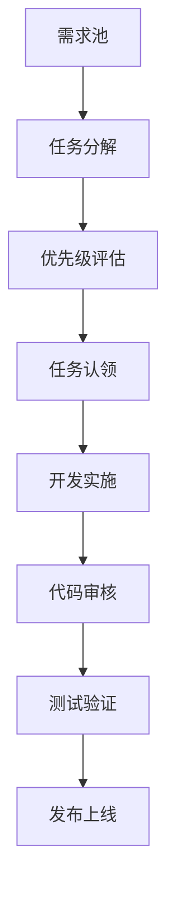

# 团队标准操作流程 (SOP)

## 团队组织架构

### 角色定义
- **负责人** (Team Lead): 项目统筹、代码审核、发布管理
- **成员A** (Frontend): 前端组件、用户界面、交互设计
- **成员B** (Backend): 后端服务、数据库、API开发
- **成员C** (Full-Stack): 全栈开发、测试、文档维护
- **成员D** (DevOps): 部署运维、性能优化、监控告警

### 沟通机制
- **日常沟通**: 团队群聊 (实时)
- **每日站会**: 上午9:00-9:15 (15分钟)
- **周会**: 每周五下午 (1小时)
- **紧急事件**: @all 群内通知

## 开发流程规范

### 1. 任务认领流程



**任务认领规则**:
- 每人同时最多认领2个任务
- 高优先级任务优先认领
- 预估工时不超过3天/任务
- 认领后24小时内开始实施

### 2. 分支管理策略

```
main        : 生产环境 (仅负责人可合并)
├── dev     : 集成测试分支
├── staging : 预发布分支
└── feature/
    ├── notification-system-A
    ├── database-migration-B
    ├── i18n-enhancement-C
    └── proposal-system-D
```

**分支命名规范**:
```bash
# 功能分支
feature/[模块名]-[成员标识]
# 示例: feature/notification-system-A

# 修复分支
fix/[问题描述]-[成员标识]
# 示例: fix/auth-redirect-B

# 热修复分支
hotfix/[紧急问题]-[成员标识]
# 示例: hotfix/payment-error-C
```

### 3. 代码提交规范

**提交消息格式**:
```
[模块][类型] 简短描述

详细描述 (可选)

关联Issue: #123
```

**类型定义**:
- `feat`: 新功能
- `fix`: 修复bug
- `docs`: 文档更新
- `style`: 代码格式调整
- `refactor`: 重构代码
- `test`: 测试相关
- `chore`: 构建/工具相关

**示例**:
```
[notification][feat] 添加实时推送服务

- 实现WebSocket连接管理
- 添加消息队列处理
- 支持多种通知类型

关联Issue: #45
```

### 4. 代码审核流程

**审核清单**:
- [ ] 功能实现符合需求
- [ ] 代码风格符合规范
- [ ] 包含必要的单元测试
- [ ] 文档更新完整
- [ ] 无明显性能问题
- [ ] 安全性检查通过

**审核流程**:
1. 开发者提交PR
2. 自动化测试运行
3. 指定审核者Review
4. 修改建议反馈
5. 负责人最终审核
6. 合并到目标分支

### 5. 测试规范

**测试层级**:
```
单元测试 (Unit Tests)
├── 函数级别测试
├── 组件级别测试
└── 服务级别测试

集成测试 (Integration Tests)
├── API端点测试
├── 数据库操作测试
└── 第三方服务测试

端到端测试 (E2E Tests)
├── 用户注册流程
├── 核心功能路径
└── 错误处理场景
```

**测试覆盖率要求**:
- 核心业务逻辑: ≥90%
- 工具函数: ≥85%
- UI组件: ≥70%
- 整体项目: ≥80%

## 质量保障

### 1. 代码质量标准

**ESLint配置**:
```json
{
  "extends": ["next/core-web-vitals", "@typescript-eslint/recommended"],
  "rules": {
    "no-unused-vars": "error",
    "no-console": "warn",
    "prefer-const": "error"
  }
}
```

**Prettier配置**:
```json
{
  "semi": false,
  "singleQuote": true,
  "tabWidth": 2,
  "trailingComma": "es5"
}
```

### 2. 性能监控

**关键指标**:
- First Contentful Paint (FCP) < 1.5s
- Largest Contentful Paint (LCP) < 2.5s
- Cumulative Layout Shift (CLS) < 0.1
- First Input Delay (FID) < 100ms

**监控工具**:
- Lighthouse CI (性能分析)
- Sentry (错误监控)
- Google Analytics (用户行为)
- Supabase Dashboard (数据库性能)

### 3. 安全检查

**安全清单**:
- [ ] 输入验证和清理
- [ ] SQL注入防护
- [ ] XSS攻击防护
- [ ] CSRF令牌验证
- [ ] 敏感数据加密
- [ ] 权限控制检查

## 发布管理

### 1. 版本号规范

**语义化版本** (Semantic Versioning):
```
MAJOR.MINOR.PATCH
例: 1.2.3

MAJOR: 不兼容的API更改
MINOR: 向后兼容的功能新增
PATCH: 向后兼容的问题修复
```

### 2. 发布流程

**每周发布计划**:
- **周一**: 功能开发开始
- **周三**: 代码冻结，集成测试
- **周四**: 预发布环境部署
- **周五**: 生产环境发布

**发布检查清单**:
- [ ] 所有测试通过
- [ ] 代码审核完成
- [ ] 文档更新完整
- [ ] 数据库迁移脚本准备
- [ ] 回滚方案制定
- [ ] 监控告警配置

### 3. 紧急发布流程

**触发条件**:
- 生产环境严重bug
- 安全漏洞修复
- 数据丢失风险

**应急响应**:
1. 立即评估影响范围
2. 创建hotfix分支
3. 快速修复并测试
4. 跳过常规审核流程
5. 直接部署到生产环境
6. 事后补充文档和测试

## 协作工具

### 1. 开发工具栈

**必需工具**:
- Git (版本控制)
- VS Code (代码编辑器)
- Node.js 18+ (运行环境)
- Docker (容器化)

**推荐插件**:
- ESLint (代码检查)
- Prettier (代码格式化)
- GitLens (Git增强)
- Thunder Client (API测试)

### 2. 项目管理

**任务跟踪**:
- GitHub Issues (bug跟踪)
- GitHub Projects (任务看板)
- Milestones (里程碑管理)

**文档管理**:
- README.md (项目概述)
- docs/ (详细文档)
- CHANGELOG.md (变更日志)
- API.md (接口文档)

## 应急预案

### 1. 生产环境故障

**响应级别**:
- **P0 (严重)**: 服务完全不可用 - 1小时内响应
- **P1 (高)**: 核心功能异常 - 4小时内响应
- **P2 (中)**: 部分功能异常 - 24小时内响应
- **P3 (低)**: 体验问题 - 72小时内响应

**处理流程**:
1. 故障确认和分级
2. 组建应急小组
3. 快速定位问题
4. 实施修复方案
5. 验证修复效果
6. 总结和改进

### 2. 团队成员临时离队

**应对措施**:
- 任务重新分配
- 知识转移会议
- 代码review加强
- 临时支援调配

### 3. 技术债务积累

**预防措施**:
- 每月技术债务评估
- 重构任务优先级管理
- 代码质量定期检查
- 架构设计评审

## 持续改进

### 1. 流程优化

**改进机制**:
- 每月流程回顾会议
- 问题收集和分析
- 最佳实践分享
- 工具和方法更新

### 2. 团队建设

**能力提升**:
- 技术分享会 (双周)
- 代码review培训
- 新技术调研
- 外部培训参与

### 3. 绩效评估

**评估维度**:
- 代码质量和数量
- 任务完成及时性
- 团队协作表现
- 技术创新贡献

---

## 附录

### A. 常用命令

```bash
# 环境设置
npm install
npm run dev

# 代码检查
npm run lint
npm run type-check

# 测试执行
npm run test
npm run test:coverage

# 构建部署
npm run build
npm run start
```

### B. 紧急联系方式

- **负责人**: [联系方式]
- **运维负责人**: [联系方式]
- **安全负责人**: [联系方式]

### C. 相关文档链接

- [产品路线图](PRODUCT_ROADMAP.md)
- [开发指南](DEVELOPMENT.md)
- [部署文档](DEPLOYMENT.md)
- [治理系统](GOVERNANCE.md)

---

*最后更新: 2024年12月*
*版本: V1.0*
*维护者: 开发团队* 