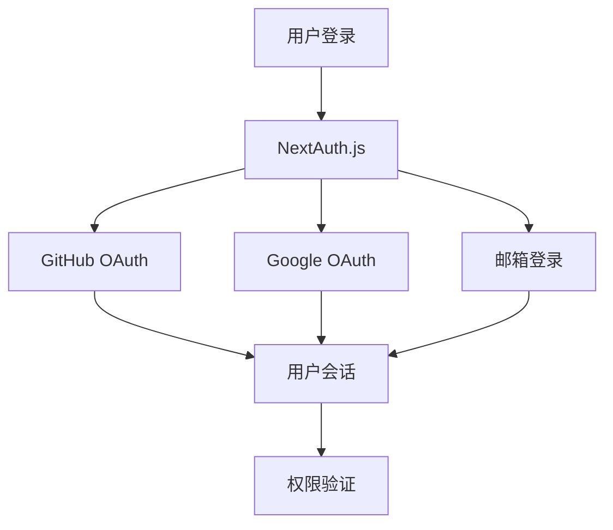
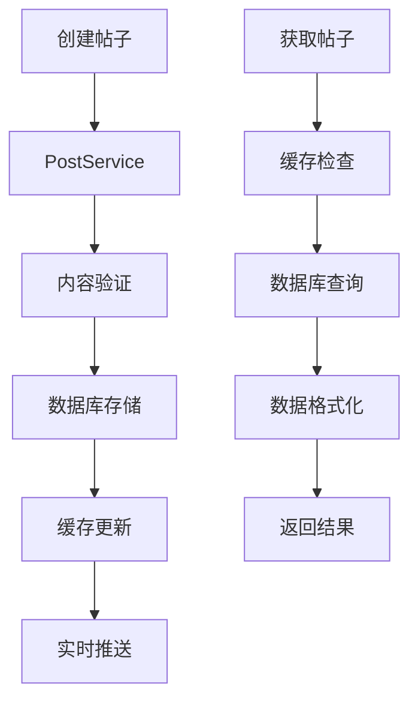
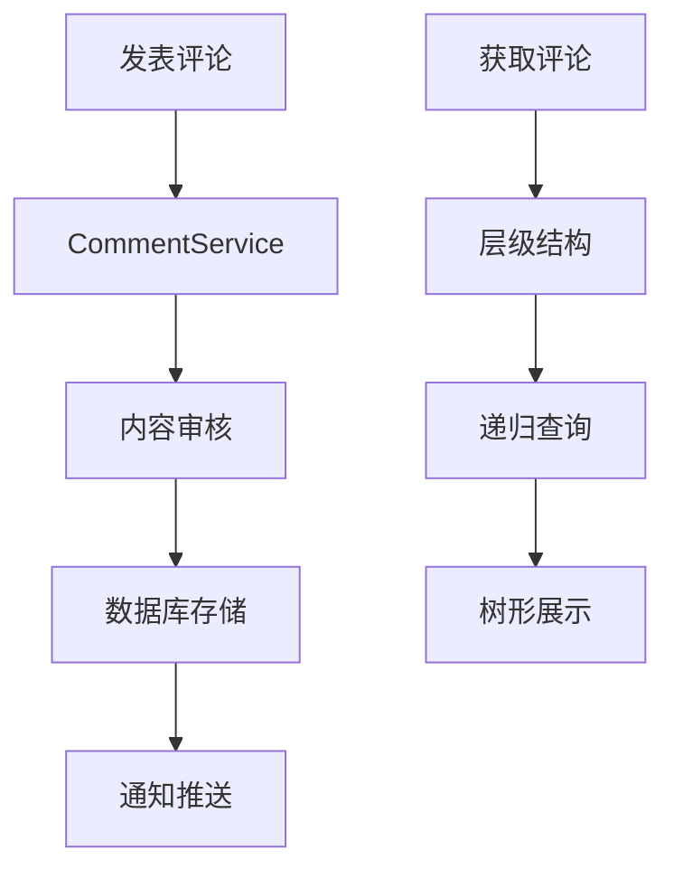
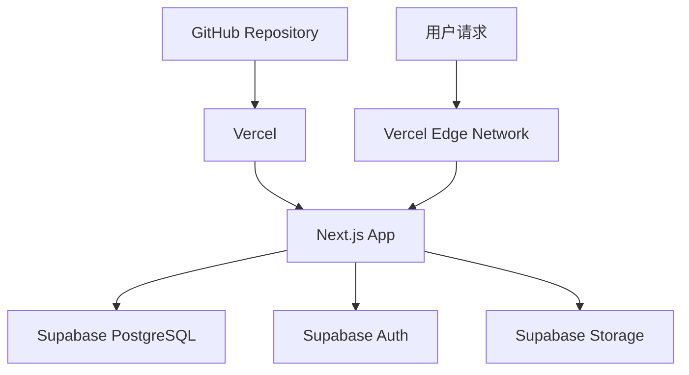

# GistFans 技术架构文档

## 📋 项目概述

GistFans 是一个现代化的开发者社交平台，采用全栈 TypeScript 技术栈构建，为开发者提供分享代码片段、技术见解和交流讨论的平台。

## 🏗️ 技术栈架构

### 前端技术栈

| 技术 | 版本 | 用途 | 选择理由 |
|------|------|------|----------|
| **Next.js** | 15.3.5 | React 全栈框架 | 提供 SSR/SSG、API Routes、优化的性能 |
| **React** | 18+ | UI 库 | 组件化开发、丰富的生态系统 |
| **TypeScript** | 5+ | 类型安全 | 提高代码质量、减少运行时错误 |
| **Tailwind CSS** | 3+ | 样式框架 | 快速开发、一致的设计系统 |
| **shadcn/ui** | Latest | 组件库 | 高质量的可复用组件 |
| **NextAuth.js** | 4+ | 身份认证 | 支持多种认证提供商 |

### 后端技术栈

| 技术 | 版本 | 用途 | 选择理由 |
|------|------|------|----------|
| **Next.js API Routes** | 15+ | API 服务 | 与前端集成、简化部署 |
| **Prisma ORM** | 5+ | 数据库 ORM | 类型安全、自动迁移 |
| **Supabase** | Latest | 数据库服务 | PostgreSQL、实时功能、认证 |
| **NextAuth.js** | 4+ | 认证服务 | 安全的会话管理 |

### 数据库架构

```
PostgreSQL (Supabase)
├── User (用户表)
├── Post (帖子表)
├── Comment (评论表)
├── Like (点赞表)
├── Follow (关注表)
├── Tag (标签表)
└── Notification (通知表)
```

## 📁 项目目录结构

```
gistfans/
├── src/
│   ├── app/                    # Next.js 13+ App Router
│   │   ├── api/               # API 路由
│   │   │   ├── auth/          # 认证相关 API
│   │   │   ├── posts/         # 帖子相关 API
│   │   │   ├── comments/      # 评论相关 API
│   │   │   └── users/         # 用户相关 API
│   │   ├── feed/              # 动态页面
│   │   ├── profile/           # 用户资料页面
│   │   ├── post/              # 帖子详情页面
│   │   └── globals.css        # 全局样式
│   ├── components/            # 可复用组件
│   │   ├── ui/               # shadcn/ui 组件
│   │   ├── layout/           # 布局组件
│   │   ├── post/             # 帖子相关组件
│   │   └── user/             # 用户相关组件
│   ├── lib/                   # 工具库
│   │   ├── services/         # 业务逻辑服务
│   │   ├── utils/            # 工具函数
│   │   ├── auth.ts           # 认证配置
│   │   └── db.ts             # 数据库连接
│   └── types/                 # TypeScript 类型定义
├── prisma/                    # 数据库相关
│   ├── schema.prisma         # 数据库模型
│   └── migrations/           # 数据库迁移
├── public/                    # 静态资源
├── docs/                      # 项目文档
└── package.json              # 项目配置
```

## 🔄 核心功能模块架构

### 1. 用户认证模块



**技术实现：**
- NextAuth.js 处理多种认证方式
- JWT 令牌管理用户会话
- 中间件保护受保护的路由

### 2. 帖子管理模块



**技术实现：**
- PostService 封装业务逻辑
- Prisma ORM 处理数据操作
- 内存缓存提升性能
- 分页和无限滚动

### 3. 评论系统模块



**技术实现：**
- 支持多级嵌套评论
- 实时评论更新
- 评论点赞和回复功能

## 🌐 数据流向和API设计

### API 设计原则

1. **RESTful 风格**：遵循 REST 设计原则
2. **统一响应格式**：标准化的 JSON 响应
3. **错误处理**：统一的错误码和消息
4. **分页支持**：支持 limit/offset 分页
5. **缓存策略**：合理的缓存机制

### 核心API端点

```typescript
// 帖子相关API
GET    /api/posts              // 获取帖子列表
POST   /api/posts              // 创建新帖子
GET    /api/posts/[id]         // 获取帖子详情
PUT    /api/posts/[id]         // 更新帖子
DELETE /api/posts/[id]         // 删除帖子

// 评论相关API
GET    /api/comments           // 获取评论列表
POST   /api/comments           // 创建评论
PUT    /api/comments/[id]      // 更新评论
DELETE /api/comments/[id]      // 删除评论

// 用户相关API
GET    /api/users/[id]         // 获取用户信息
PUT    /api/users/[id]         // 更新用户信息
GET    /api/users/[id]/posts   // 获取用户帖子

// 认证相关API
POST   /api/auth/signin        // 用户登录
POST   /api/auth/signout       // 用户登出
GET    /api/auth/session       // 获取会话信息
```

## 🚀 部署架构

### 生产环境部署



**部署配置：**
- **前端**：Vercel 自动部署
- **数据库**：Supabase PostgreSQL
- **认证**：Supabase Auth + NextAuth.js
- **存储**：Supabase Storage（图片/文件）
- **CDN**：Vercel Edge Network

### 环境变量配置

```bash
# 数据库
DATABASE_URL="postgresql://..."
DIRECT_URL="postgresql://..."

# 认证
NEXTAUTH_SECRET="..."
NEXTAUTH_URL="..."

# OAuth 提供商
GITHUB_CLIENT_ID="..."
GITHUB_CLIENT_SECRET="..."
GOOGLE_CLIENT_ID="..."
GOOGLE_CLIENT_SECRET="..."

# Supabase
NEXT_PUBLIC_SUPABASE_URL="..."
NEXT_PUBLIC_SUPABASE_ANON_KEY="..."
SUPABASE_SERVICE_ROLE_KEY="..."
```

## ⚡ 性能优化策略

### 1. 缓存机制

```typescript
// 内存缓存
const cache = new Map()

// Redis 缓存（推荐升级）
// const redis = new Redis(process.env.REDIS_URL)

// 缓存策略
- 帖子列表：5分钟缓存
- 用户信息：10分钟缓存
- 评论数据：2分钟缓存
```

### 2. 数据库优化

- **索引优化**：关键字段添加索引
- **查询优化**：使用 Prisma 的 include 和 select
- **连接池**：Supabase 自动管理连接池
- **分页查询**：避免大量数据查询

### 3. 前端优化

- **代码分割**：Next.js 自动代码分割
- **图片优化**：Next.js Image 组件
- **静态生成**：ISR（增量静态再生）
- **预加载**：关键资源预加载

## 🔒 安全策略

### 1. 认证安全

- JWT 令牌过期机制
- CSRF 保护
- 安全的会话管理
- OAuth 2.0 标准

### 2. 数据安全

- SQL 注入防护（Prisma ORM）
- XSS 防护（内容转义）
- 输入验证和清理
- 权限控制（RBAC）

### 3. API 安全

- 速率限制
- 请求验证
- 错误信息脱敏
- HTTPS 强制

## 📊 监控和日志

### 当前实现

```typescript
// 简单日志记录
console.log('📡 API请求:', { method, url, params })
console.log('⚡ 数据库查询完成:', { duration, count })
console.log('✅ 操作成功:', result)
console.log('❌ 操作失败:', error)
```

### 推荐升级

- **错误监控**：Sentry 集成
- **性能监控**：Vercel Analytics
- **日志管理**：结构化日志
- **指标收集**：自定义指标

## 🔄 开发工作流

### 1. 开发环境

```bash
# 安装依赖
npm install

# 启动开发服务器
npm run dev

# 数据库迁移
npx prisma db push
npx prisma generate

# 类型检查
npm run type-check

# 代码格式化
npm run lint
```

### 2. 部署流程

1. **开发** → 本地开发和测试
2. **提交** → Git 提交到 main 分支
3. **构建** → Vercel 自动构建
4. **部署** → 自动部署到生产环境
5. **验证** → 功能验证和监控

## 🎯 技术债务和改进计划

### 短期改进（1-2周）

- [ ] 添加 Redis 缓存
- [ ] 集成错误监控（Sentry）
- [ ] 优化数据库查询
- [ ] 添加单元测试

### 中期改进（1-2月）

- [ ] 实现实时功能（WebSocket）
- [ ] 添加图片处理服务
- [ ] 性能监控集成
- [ ] API 文档生成

### 长期改进（3-6月）

- [ ] 微服务架构迁移
- [ ] 容器化部署
- [ ] CI/CD 流水线优化
- [ ] 多语言支持

---

**文档版本**：v1.0  
**最后更新**：2025-01-23  
**维护者**：开发团队
