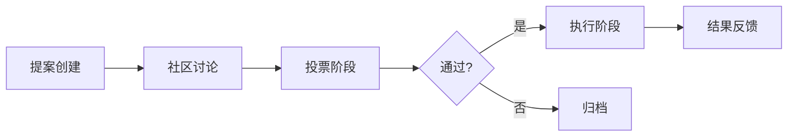
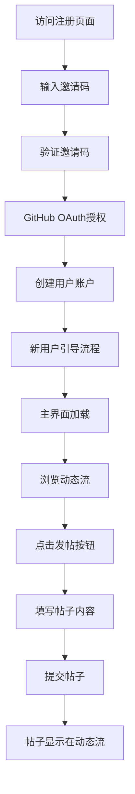

# GistFans 技术实现文档

## 一、通知系统 (Notification System)

### 功能目标
1. 实时接收他人消息（评论/点赞/关注）
2. 系统通知（提案更新/Star奖励/平台公告）
3. 多通道推送（应用内/邮件/Web推送）

### 技术实现
```typescript
// 通知类型定义
export type NotificationType = 
  | 'COMMENT' 
  | 'LIKE'
  | 'FOLLOW'
  | 'PROPOSAL_UPDATE'
  | 'STAR_REWARD'
  | 'SYSTEM_ALERT';

// 通知实体
export interface Notification {
  id: string;
  userId: string; // 接收用户ID
  type: NotificationType;
  senderId?: string; // 发送者ID（如为互动通知）
  content: string; // 通知内容
  relatedEntityId?: string; // 关联实体ID（如帖子/提案ID）
  isRead: boolean;
  createdAt: Date;
}
```

### 数据库模型 (Supabase)
```sql
model Notification {
  id          String   @id @default(uuid())
  userId      String   @db.Uuid
  type        String
  senderId    String?  @db.Uuid
  content     String
  entityId    String?
  isRead      Boolean  @default(false)
  createdAt   DateTime @default(now())
  
  @@index([userId])
}
```

### API端点
```typescript
// 获取用户通知
export async function GET(req: Request) {
  const session = await getSession();
  if (!session) return new Response('Unauthorized', { status: 401 });
  
  const notifications = await prisma.notification.findMany({
    where: { userId: session.user.id },
    orderBy: { createdAt: 'desc' },
    take: 20
  });
  
  return NextResponse.json(notifications);
}

// 标记通知为已读
export async function PATCH(req: Request) {
  // 实现逻辑
}
```

### 前端组件
```typescript
export default function NotificationCenter() {
  const [notifications, setNotifications] = useState<Notification[]>([]);
  
  useEffect(() => {
    // 使用WebSocket或SSE实时获取通知
    const eventSource = new EventSource('/api/notifications/stream');
    eventSource.onmessage = (event) => {
      setNotifications(prev => [JSON.parse(event.data), ...prev]);
    };
    
    return () => eventSource.close();
  }, []);

  return (
    <div className="notification-panel">
      {notifications.map(notif => (
        <NotificationItem 
          key={notif.id} 
          notification={notif} 
          onMarkAsRead={() => markAsRead(notif.id)}
        />
      ))}
    </div>
  );
}
```

## 二、Supabase数据库迁移与完善

### 数据库架构升级
```prisma
// 评论系统增强
model Comment {
  id        String   @id @default(uuid())
  content   String
  postId    String
  authorId  String
  parentId  String?  // 支持嵌套评论
  stars     Int      @default(0)
  createdAt DateTime @default(now())
  
  @@index([postId])
}

// Star交易记录
model StarTransaction {
  id          String   @id @default(uuid())
  senderId    String
  receiverId  String
  amount      Int
  type        String   // VOTE, REWARD, TRANSFER
  relatedId   String?  // 关联的提案/评论ID
  createdAt   DateTime @default(now())
}
```

### 迁移步骤
1. **数据迁移脚本**
   ```javascript
   import { PrismaClient } from '@prisma/client';
   import { createClient } from '@supabase/supabase-js';

   const prisma = new PrismaClient();
   const supabase = createClient(process.env.SUPABASE_URL, process.env.SUPABASE_KEY);

   async function migrateUsers() {
     const users = await prisma.user.findMany();
     for (const user of users) {
       await supabase.from('users').insert({ ...user });
     }
   }
   // 其他表迁移逻辑...
   ```

2. **环境配置**
   ```env
   SUPABASE_URL="https://<project>.supabase.co"
   SUPABASE_KEY="<your-anon-key>"
   DATABASE_URL="postgresql://postgres:<password>@db.<project>.supabase.co:5432/postgres"
   ```

## 三、多语言覆盖完善

### 实现方案
1. **语言文件结构**
   ```
   locales/
     en/
       common.json
       notifications.json
       proposals.json
     zh/
       common.json
       ...
   ```

2. **动态加载逻辑**
   ```typescript
   const LanguageProvider = ({ children }: { children: ReactNode }) => {
     const [language, setLanguage] = useState<'en' | 'zh'>('en');
     const [translations, setTranslations] = useState<Record<string, string>>({});
     
     useEffect(() => {
       const loadTranslations = async () => {
         const module = await import(`../locales/${language}/common.json`);
         setTranslations(module.default);
       };
       loadTranslations();
     }, [language]);

     return (
       <LanguageContext.Provider value={{ language, setLanguage, t: (key) => translations[key] || key }}>
         {children}
       </LanguageContext.Provider>
     );
   };
   ```

3. **UI组件集成**
   ```typescript
   const { t } = useLanguage();
   
   return (
     <div className="proposal-card">
       <h3>{t('proposal.title')}</h3>
       <p>{t('proposal.description')}</p>
     </div>
   );
   ```

## 四、提案系统完善

### 提案生命周期


### 数据库模型
```prisma
model Proposal {
  id          String   @id @default(uuid())
  title       String
  description String
  creatorId   String
  status      String   // DRAFT, VOTING, APPROVED, REJECTED, IMPLEMENTED
  starCost    Int      // 创建提案消耗的Star
  voteStart   DateTime?
  voteEnd     DateTime?
  createdAt   DateTime @default(now())
  
  @@index([creatorId, status])
}

model Vote {
  id         String   @id @default(uuid())
  proposalId String
  userId     String
  starsUsed  Int      // 投入的Star数量
  direction  String   // FOR/AGAINST
  votedAt    DateTime @default(now())
}
```

### API端点
```typescript
// 创建提案
export async function POST(req: Request) {
  const { title, description } = await req.json();
  const session = await getSession();
  
  // 扣除创建者Star
  await prisma.starTransaction.create({
    data: {
      senderId: session.user.id,
      receiverId: PLATFORM_ID, // 平台账户
      amount: PROPOSAL_CREATION_COST,
      type: 'PROPOSAL_FEE'
    }
  });
  
  // 创建提案
  const proposal = await prisma.proposal.create({
    data: { title, description, creatorId: session.user.id }
  });
  
  return NextResponse.json(proposal);
}

// 投票接口
export async function PUT(req: Request) {
  // 实现投票逻辑
}
```

### 前端工作流
```typescript
export default function ProposalDetail() {
  const [proposal, setProposal] = useState<Proposal | null>(null);
  const [userVote, setUserVote] = useState<Vote | null>(null);
  
  return (
    <div className="proposal-container">
      <ProposalHeader proposal={proposal} />
      
      {proposal.status === 'VOTING' && (
        <VotingSection 
          proposal={proposal} 
          userVote={userVote}
          onVote={(stars, direction) => handleVote(stars, direction)}
        />
      )}
      
      <ProposalTimeline status={proposal.status} />
    </div>
  );
}
```

## 五、用户从注册到首次发帖的交互流程

### 完整用户流程图


### 关键交互点详细说明

1. **注册入口** (`/app/auth/register/page.tsx`)
   - 用户输入邀请码
   - 前端调用 `/api/invite/validate` 验证
   - 验证成功后显示GitHub登录按钮

2. **OAuth认证** (`/api/auth/[...nextauth]/route.ts`)
   - 重定向到GitHub授权页面
   - GitHub回调后创建会话
   - 使用`custom-prisma-adapter`创建用户

3. **新用户引导** (`/app/auth/onboarding/page.tsx`)
   - 强制新用户填写技术偏好
   - 提交到`/api/user/complete-onboarding`
   - 更新用户状态为"已激活"

4. **主界面加载** (`/app/feed/page.tsx`)
   - 使用`useCurrentUser`钩子获取用户
   - 从PostContext获取帖子数据
   - 渲染动态流列表

5. **发帖流程** (`components/PostForm.tsx`)
   - 用户点击发帖按钮打开表单
   - 表单包含标题/内容/标签字段
   - 提交到`/api/comments/route.ts`
   - 成功后在PostContext更新状态

6. **帖子显示** (`app/feed/page.tsx`)
   - 新帖子插入动态流顶部
   - 显示用户头像和内容
   - 附带点赞/评论功能入口

### 关键文件依赖
- **路由控制**：`next.config.ts` 定义路由规则
- **状态管理**：`contexts/PostContext.tsx` 处理帖子状态
- **数据获取**：`lib/prisma.ts` 数据库操作
- **UI组件**：`components/ui/textarea.tsx` 发帖输入框

### 异常处理分支
- 邀请码无效 → 显示错误提示
- OAuth失败 → 跳转`/app/auth/error`
- 发帖内容为空 → 表单验证错误
- 提交失败 → 显示API错误信息

## 六、实施路线图

### 第一阶段任务分配

| 成员 | 负责模块 | 预计时间 | 交付物 |
|------|----------|----------|--------|
| 成员A | 通知系统 | 5天 | `NotificationService` 完整实现 |
| 成员B | Supabase迁移 | 3天 | 数据库迁移脚本+适配层 |
| 成员C | 多语言系统 | 4天 | 语言包+动态加载组件 |
| 成员D | 提案系统 | 7天 | 提案生命周期管理 |

### 质量保障措施
1. **自动化检查**：ESLint + Prettier 强制代码风格
2. **测试覆盖率**：每个模块≥80%单元测试覆盖率
3. **文档完整性**：模块必须包含`README.md`和示例代码
4. **性能基线**：关键API响应时间<300ms

### 紧急情况处理
- **构建失败**：立即回滚最后合并的PR
- **生产事故**：负责人启动回滚流程（5分钟内）
- **进度延迟**：启用备用方案（负责人提供代码补全）

---

*最后更新: 2024年12月*
*版本: V1.0*
*维护者: 开发团队* 