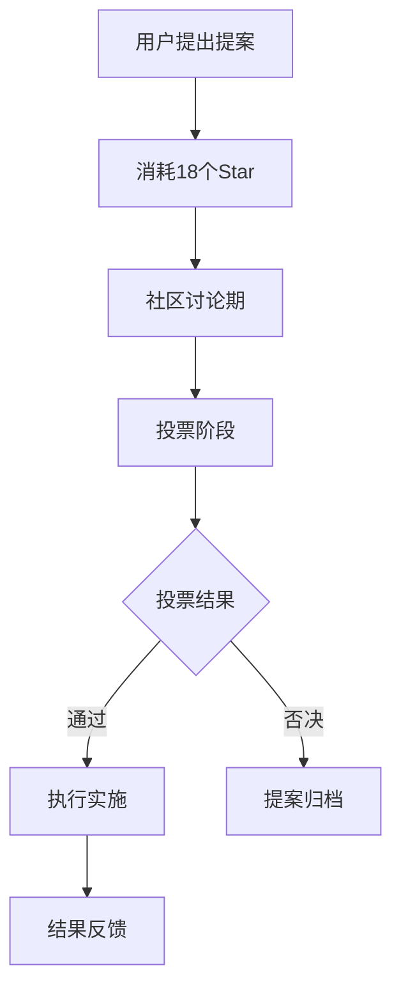

# 🌟 GistFans 社区文化与治理体系

## 📋 核心理念和精神内涵

### **GistFans的使命**
基于项目实际功能分析，GistFans致力于打造一个**用户驱动的开发者社区平台**，通过创新的Star治理机制实现真正的社区自治。

#### **核心价值观 (基于实际系统设计)**
1. **平等参与** - 每个用户都有平等的发言权和投票权
2. **贡献导向** - 通过Star系统量化和奖励社区贡献
3. **透明治理** - 所有决策通过公开透明的提案投票机制
4. **知识共享** - 鼓励技术分享和经验交流
5. **协作共赢** - 构建互助互利的开发者生态

#### **社区精神内涵**
- **技术至上**: 以技术能力和贡献为评判标准
- **开放包容**: 欢迎不同背景的开发者参与
- **持续学习**: 鼓励知识分享和技能提升
- **创新驱动**: 支持新技术探索和实践
- **社区自治**: 通过民主机制实现社区管理

## ⭐ Star系统：社区治理的核心机制

### **Star系统设计哲学**
基于实际的StarBalance、StarTransaction、StarVote模型分析：

#### **1. Star的本质**
```typescript
// 基于实际StarBalance模型
interface StarBalance {
  totalStars: number      // 总获得Star数 (声誉积累)
  availableStars: number  // 可用Star数 (治理权力)
  dailyEarned: number     // 每日获得 (活跃度奖励)
  maxDailyBasic: number   // 每日上限 (防止通胀)
}
```

Star不仅是积分，更是：
- **声誉象征**: 总Star数体现用户在社区的贡献和地位
- **治理权力**: 可用Star数决定用户的投票影响力
- **激励机制**: 通过Star奖励鼓励高质量内容和积极参与

#### **2. Star获取机制 (基于实际代码)**
```typescript
// 实际的Star获取规则
const STAR_RULES = {
  DAILY_LOGIN: 1,           // 每日登录奖励
  DAILY_BASIC_MAX: 3,       // 每日基础上限
  CONTENT_RECEIVE_VOTE: 1,  // 收到投票奖励
  PROPOSAL_THRESHOLD: 18,   // 创建提案消耗
}
```

**获取方式**:
- **日常活跃**: 每日登录获得1个Star，最多3个
- **内容贡献**: 发布优质帖子收到他人Star投票
- **社区互动**: 参与评论讨论获得认可
- **技术分享**: 深度技术内容获得额外奖励

#### **3. Star使用机制 (基于实际投票系统)**
```typescript
// 实际的Star投票实现
async voteStarForPost(fromUserId, toUserId, postId, amount) {
  // 1. 检查余额充足
  // 2. 防止重复投票
  // 3. 从投票者扣除Star
  // 4. 给作者增加Star
  // 5. 记录投票交易
}
```

**使用场景**:
- **内容投票**: 为优质帖子投Star (1-10个)
- **提案创建**: 创建社区提案消耗18个Star
- **提案投票**: 参与治理决策投入Star
- **未来扩展**: 悬赏问题、技能认证等

### **Star经济学原理**
#### **通胀控制机制**
- **每日上限**: 防止Star过度增发
- **消耗机制**: 投票和提案消耗Star
- **价值锚定**: Star价值与社区贡献挂钩

#### **激励相容设计**
- **投票激励**: 投出的Star转移给作者，鼓励发现优质内容
- **创作激励**: 优质内容获得Star奖励，鼓励高质量创作
- **治理激励**: 参与治理消耗Star，确保认真对待

## 🏛️ 社区治理结构

### **基于Proposal系统的民主治理**
基于实际的Proposal、ProposalVote、ProposalStarVote模型：

#### **1. 提案系统架构**
```typescript
// 实际的提案数据模型
interface Proposal {
  id: string
  title: string
  description: string
  category: 'feature' | 'policy' | 'community' | 'other'
  authorId: string
  status: 'active' | 'approved' | 'rejected'
  requiredStars: 18        // 创建提案门槛
  votes: VoteCount         // 普通投票统计
  starVotes: VoteCount     // Star投票统计
  expiresAt: DateTime      // 投票截止时间
}
```

#### **2. 治理决策流程**


#### **3. 投票机制设计**
```typescript
// 实际的投票实现
interface VotingSystem {
  normalVote: {
    weight: 1,              // 每人一票
    threshold: "简单多数"    // 50%+1
  },
  starVote: {
    weight: "投入Star数",    // 按Star数加权
    threshold: "Star多数"    // Star总数的50%+1
  }
}
```

**双重投票机制**:
- **民主投票**: 一人一票，体现平等参与
- **Star投票**: 按贡献加权，体现能力导向
- **双重门槛**: 两种投票都需要达到阈值

### **治理范围和权限**
#### **社区治理事项**
- **功能开发**: 新功能提案和优先级
- **规则制定**: 社区行为准则和管理规定
- **资源分配**: Star奖励规则和分配机制
- **技术决策**: 技术栈选择和架构调整

#### **管理员职责**
基于实际的管理员系统：
- **系统维护**: 技术运维和安全保障
- **规则执行**: 违规处理和争议仲裁
- **数据管理**: 用户管理和内容审核
- **紧急处理**: 突发事件和安全响应

## 👥 用户互动规则和内容标准

### **基于邀请制的准入机制**
基于实际的InviteCode模型：

#### **邀请制度设计**
```typescript
// 实际的邀请码模型
interface InviteCode {
  code: string           // 唯一邀请码
  createdById: string    // 创建者ID
  maxUses: number        // 最大使用次数
  usedCount: number      // 已使用次数
  expiresAt: DateTime    // 过期时间
  isActive: boolean      // 是否有效
}
```

**邀请制的目的**:
1. **质量控制**: 通过邀请筛选确保用户质量
2. **社区氛围**: 建立相互推荐的信任关系
3. **增长管理**: 控制用户增长速度和规模
4. **责任机制**: 邀请者对被邀请者行为负责

#### **邀请码管理机制**
- **管理员生成**: 管理员可批量生成邀请码
- **用户推荐**: 活跃用户可获得邀请码配额
- **使用限制**: 每个邀请码限制使用次数和有效期
- **追踪机制**: 记录邀请关系和使用情况

### **内容质量标准**
#### **优质内容特征**
- **技术深度**: 具有实际技术价值和指导意义
- **原创性**: 鼓励原创内容，标注转载来源
- **实用性**: 能够解决实际问题或提供有用信息
- **完整性**: 内容结构完整，表达清晰

#### **内容审核机制**
基于实际的评论系统和Star投票：
- **社区自治**: 通过Star投票体现内容质量
- **同行评议**: 专业开发者的认可和反馈
- **管理员介入**: 处理违规和争议内容
- **透明公开**: 审核标准和结果公开透明

### **用户行为准则**
#### **鼓励的行为**
- **技术分享**: 分享项目经验和技术心得
- **互助协作**: 帮助他人解决技术问题
- **建设性讨论**: 理性讨论技术方案和观点
- **社区贡献**: 参与社区治理和功能建设

#### **禁止的行为**
- **恶意攻击**: 人身攻击、恶意诽谤
- **垃圾内容**: 无意义刷屏、广告推广
- **抄袭剽窃**: 未经授权使用他人作品
- **系统滥用**: 恶意刷Star、虚假投票

## 🚀 社区发展愿景和长期目标

### **短期目标 (6个月内)**
#### **功能完善**
- **实时通信**: 完善消息系统和通知机制
- **协作工具**: 实现屏幕共享和远程协作
- **移动适配**: 优化移动端用户体验
- **国际化**: 完善多语言支持

#### **社区建设**
- **用户增长**: 达到1000+活跃用户
- **内容质量**: 建立优质内容库
- **治理完善**: 完善提案和投票机制
- **文化建设**: 形成独特的社区文化

### **中期目标 (1-2年)**
#### **平台扩展**
- **技能认证**: 基于Star的技能认证体系
- **项目孵化**: 支持开源项目孵化和协作
- **知识图谱**: 构建技术知识图谱和推荐系统
- **生态集成**: 与GitHub、GitLab等平台深度集成

#### **商业模式**
- **开发者服务**: 提供专业开发者服务匹配
- **企业合作**: 为企业提供人才推荐和技术咨询
- **教育培训**: 开展技术培训和认证服务
- **工具服务**: 提供开发工具和基础设施服务

### **长期愿景 (3-5年)**
#### **成为开发者生态的核心枢纽**
- **全球影响**: 成为全球开发者社区的重要平台
- **技术引领**: 在开发者协作和治理方面引领创新
- **价值创造**: 为开发者创造实际价值和职业机会
- **社会影响**: 推动开源文化和技术民主化

#### **技术创新目标**
- **AI集成**: 智能推荐和自动化协作
- **区块链**: 去中心化治理和价值分配
- **元宇宙**: 虚拟协作空间和沉浸式体验
- **Web3**: 构建真正的去中心化开发者社区

## 📊 治理效果评估

### **关键指标体系**
#### **参与度指标**
- **提案数量**: 月度提案创建数量
- **投票参与**: 投票参与率和Star投入量
- **内容质量**: 平均Star投票数和互动率
- **用户活跃**: 日活跃用户和留存率

#### **治理质量指标**
- **决策效率**: 提案处理时间和执行率
- **社区满意度**: 用户满意度调研结果
- **争议处理**: 争议解决时间和满意度
- **规则遵守**: 违规率和处理效果

### **持续改进机制**
#### **定期评估**
- **月度回顾**: 治理效果和问题总结
- **季度调整**: 规则优化和机制改进
- **年度规划**: 长期发展战略调整
- **社区反馈**: 定期收集用户意见和建议

#### **动态优化**
- **数据驱动**: 基于数据分析优化治理机制
- **实验验证**: 小范围试验新的治理方案
- **社区共识**: 重大变更通过社区投票决定
- **透明公开**: 所有改进过程公开透明

---

**文档版本**: v1.0  
**创建时间**: 2025-07-28  
**基于**: 项目实际代码和功能分析  
**维护**: 社区治理委员会
